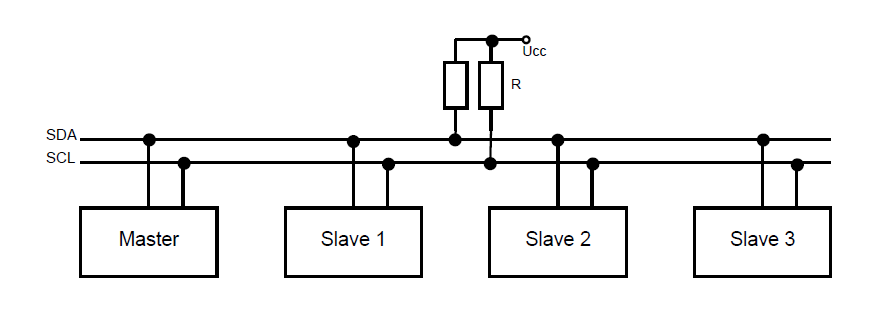
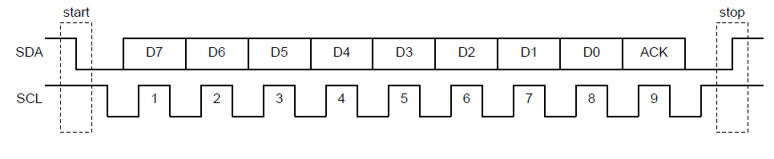
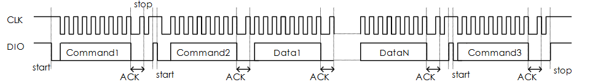
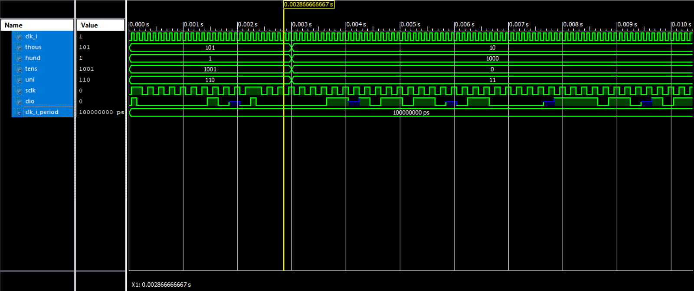
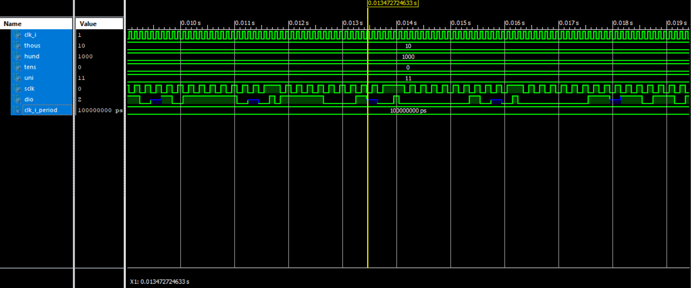
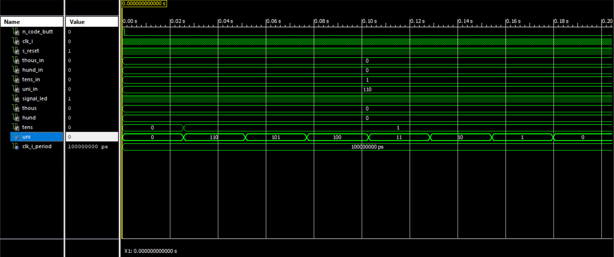
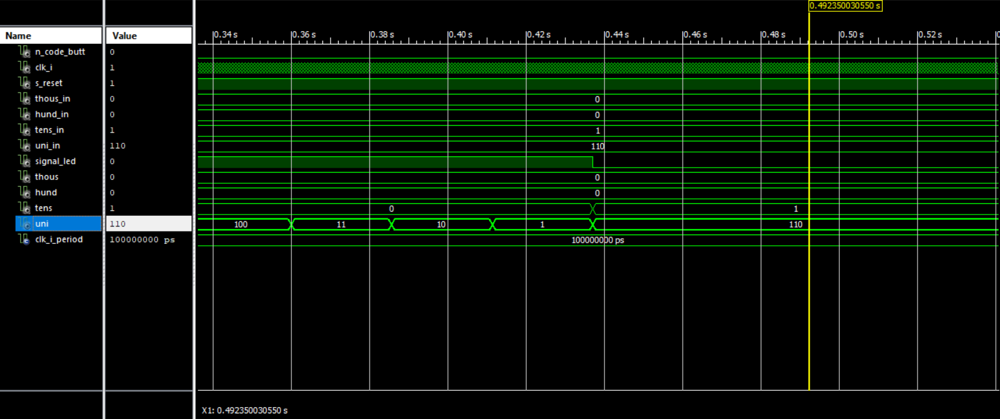
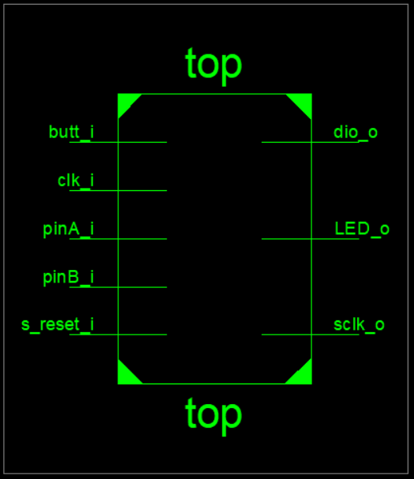

# COUNTDOWN S N-KODÉREM A DISPLEJEM OVLÁDANÝM POMOCÍ DVOUVODIČOVÉ SBĚRNICE #       
Úkolem je pomocí n-kodéru KY_040 nastavit žádanou hodnotu odpočtu a pomocí jeho tlačítka tento odpočet spustit. Ke zobrazování má sloužit čtyřdigitový sedmisegmentový displej obsluhovaný řadičem TM1637, který je ovládán dvouvodičovou sběrnicí na bázi I2C.   

#### TM1637
TM1637 je integrovaný obvod, který umožňuje po specifickém komunikačním rozhraní ovládat až 6 jednodigitových sedmisegmentových displejů.
Komunikační rozhraní je založeno na bázi dvouvodičové sběrnice I2C. Rozdíl je především ve způsobu komunikace.

#### I2C - zjednodušený popis
Je multimastrová počítačová sběnice užívaná v nízkorychlostních systémech, např. připojení periferií k základní desce, vestavěnému systému
nebo mobilnímu telefonu. Rozhraní umožňuje připojit až 128 zařízení na obousměrnou dvouvodičovou datovou linku. Rozpoznáváme zařízení 
*master* nebo *slave*. Vodiče nazýváme *SDA* (Synchronous data) a *SCL* (Synchronous clock). Oba jsou připojeny pull-up rezistorem k vysoké úrovni - HIGH v klidovém stavu. Změna úrovně *SDA* je možna pouze když je úroveň *SCL* nízká. To neplatí v případě odesílání tzv. *STOP bitu* a *START bitu*, kterými komunikace počíná a končí. Zařízení, které chce poslat data (master), vyšle start bit - SCL: HIGH a SDA: sestupná hrana - čímž se všechna zařízení na lince připraví k příjmu. Master odešle sedmibitovou adresu a jednobitový požadavek na přenos *R/W* (čtení/zápis). Příjemce (slave) ztotožněný s vyslanou adresou vyšle potvrzovací bit, tzv. *ACK*. Následuje samotná datová komunikace, kdy kažý byte je následován ACK bitem, směr komunikace určen R/W bitem, obsaženým ve zprávě, a konec komunikace zakončen STOP bitem.

*Obrázky: www.zavavov.cz.*     
**Důležité je pořadí přenosu bitů. Jak je znázorněno na obrázku, komunikace začíná MSB bitem zprávy a končí LSB bitem zprávy.**

#### Komunikační linka TM1637
Zapojení je opět dvouvodičové (vodiče *CLK* a *DIO*; jiné pojmenování oproti I2C kvůli licenčním důvodům, funkce je však stejná) s pull-up rezistory. Jelikož u tohoto typu komunikace neexistuje adresování (základní rozdíl od I2C), lze na linku připojit pouze jeden SLAVE obvod (nebo více, ale všechna SLAVE zařízení budou přijímat stejná data). Přenos dat se pak děje stejně jako u I2C  tím rozdílem, že jako **první z datového slova odesíláme LSB bit**.

O nastavení TM1637 a jeho displejů rozhodují 3 datová slova, kterým budeme říkat příkazy. První příkaz určuje zda chceme data číst či zapisovat, zda chceme adresu digitu nastavit fixně či inkrementovat od zvolené hodnoty, atd... (viz. tabulka). V naší impelemntaci užíváme slovo *01000000*. Jeho význam lze slovně popsat jako: nastavení displeje pro zápis do normálního módu s automatickou inkrementací adresy od počáteční adresy nastavenou dalším příkazem.

|B7|B6|B5|B4|B3|B2|B1|B0|Význam|
|----|----|----|----|----|----|----|----|-----------------|
|0|1|0|0|||0|0|zápis dat do registru|
|0|1|0|0|||1|0|čtení, data z klávesnice|
|0|1|0|0||0|||automatická inkrementace adresy digitu|
|0|1|0|0||1|||nastavení adresy digitu fixně|
|0|1|0|0|0||||normální mód|
|0|1|0|0|1||||testovací mód|

Druhý příkaz určuje adresu prvního digitu, od které bude inkrementováno. V našem případě kdy užíváme 4 digitový displej, jsou adresy vyšší jak 0xC3 ignorovány.

|B7 |   B6 |   B5|    B4 |   B3 |   B2 |   B1 |   B0|Význam|
|----|----|----|----|----|----|----|----|-----------------|
|1|1|0|0|0|0|0|0|0xC0 - 1. digit od leva|
|1|1|0|0|0|0|1|0|0xC1 - 2. digit od leva|
|1|1|0|0|0|0|1|0|0xC2 - 3. digit od leva|
|1|1|0|0|0|0|1|1|0xC3 - 4. digit od leva|
|1|1|0|0|0|1|0|0|0xC4 - 5. digit od leva|
|1|1|0|0|0|1|0|1|0xC5 - 6. digit od leva|

Třetí příkaz udává zda budou displeje indikovat a také jak velkým jasem

|B7 |   B6 |   B5|    B4 |   B3 |   B2 |   B1 |   B0|Význam|
|----|----|----|----|----|----|----|----|-----------------|
|1|0|0|0||0|0|0| PWM 1/16|
|1|0|0|0||0|0|1| PWM 2/16|
|1|0|0|0||0|1|0| PWM 4/16|
|1|0|0|0||0|1|1| PWM 10/16|
|1|0|0|0||1|0|0| PWM 11/16|
|1|0|0|0||1|0|1| PWM 12/16|
|1|0|0|0||1|1|0| PWM 13/16|
|1|0|0|0||1|1|1| PWM 14/16|
|1|0|0|0|0|||| display OFF|
|1|0|0|0|1|||| display ON|

**Popis entity TM1637**    
Komunikace počíná START bitem a pak s každou nízkou úrovní vodiče CLK je vyslán jeden bit osmibitového slova. Začínáme bitem LSB. Po odeslání posledního bitu, nastavujeme DIO na vysokou impedanci, protože TM1637 odesílá ACK potvrzovací bit, který my ve skutečnosti nečteme (nelze v průběhu kódu nastavovat zda je proměnná výstupem či vstupem). Po tomto odešleme STOP bit prvního příkazu a hned za ním START bit druhého příkazu. Po odeslání druhého příkazu pouze nastavíme DIO na "příjem" ACK bitu a po něm začneme ihned posílat data pro první námi zvolený digit. Po jeho odeslání opět nastavíme "příjem" ACK bitu a začneme posílat data pro další digit. Podle tohoto vzorce odešleme data pro potřebný počet digitů a poslední digit zakončíme STOP bitem. Nakonec odešleme START bit posledního příkazu, příkaz samotný a jeho patřičné zakončení. Názorně je komunikace popsána na dalším obrázku.   

*Obrázek: katalogový list TM1637; Titan micro electronics*
     
Entita přijímá 4 integerovské proměnné, které představují tisíce, stovky, desítky a jednotky. Tyto proměnné jsou odesílány z entity nazvané *control_logic* (popis níže). Proměnné jsou převedeny do kódu pro
sedmisegmentový displej a to počátkem každé komunikační sekvence (tzn. odeslání prvních dvou commandů, pak postupné odeslání čtyřech digitů a nakonec odeslání posledního, třetího, commandu). Nemůže se tedy stát, že by se v průběhu sekvence změnila hodnota odesílaných digitů a to z důvodu špatného zobrazení cifer (odeslání trvá asi 15 ms; pokud to nebude vyhovující rychlost, je třeba zmenšit periodu interních hodin CPLD - s tím se ale změní i rychlost odpočtu).  
Není zde implementován ani jakýkoliv reset. Ten se nachází pouze v entitách pro odpočet a čtení dat z n-kodéru. Resetem v průběhu komunikační sekvence by byla celá přerušena a bylo by nutno celé zařízení odpojit od napájení a znovu připojit (reset by bylo možné implementovat za případu, že bysme četly ACK bit).      

      
*Obrázek: odeslání prvních dvou příkazů a digitů odpovídajícím tisícům, stovkám a desítkám (lze také vidět, že nelze měnit hodnoty vysílaných dat v průběhu vysílací sekvence)*       

     
*Obrázek: odeslání posleního digitu, třetího příkazu a znázornění počátku následující zobrazovací sekvence.*

**Popis entity control_logic**       
Tato entita má na starosti odesílání hodnot jednotlivých cifer pro driver dipleje. Při režimu nastavování hodnoty, tj. když není stlačeno tlačítko n-kodéru ani synchronního resetu, pouze sleduje hodnoty proměnných vycházejících z driveru pro n-kodér (tisíce, stovky, desítky, jednotky) a poskytuje je driveru displeje. Pakliže stlačíme resetovací tlačítko, všechny proměnné se vynulují a nastavování hodnoty běží od začátku. Po nastavení žádané hodnoty, stiskneme tlačítko n-kodéru, čímž se jednak zablokuje další nastavování hodnoty a jednak spustí odpočet nastavené hodnoty do nuly. Tento odpočet lze přerušit pouze resetovacím tlačítkem. Když zařízení odpočítá do nuly, sepne se signalizační výstup (v našem případě rozsvícení LED diody) a nastaví se aktuální hodnota přijatá entitou ovládající n-kodér. Signalizační výstup je aktivní až do nastavení a započetí odpočtu následující hodnoty.   

       
*Obrázek: odpočet od nastavené hodnoty pomocí driveru KY_040*

     
*Obrázek: aktivace signalizačního výstupu při dokončení odpočtu a opětovné nastavení hodnoty na základě dat z KY_040*       

**top**       

*Zobrazení vstupů a výstupů na horním obrázku a svázání entit vnitřními signály na dolním obrázku*

